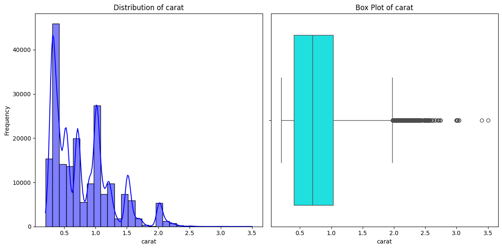
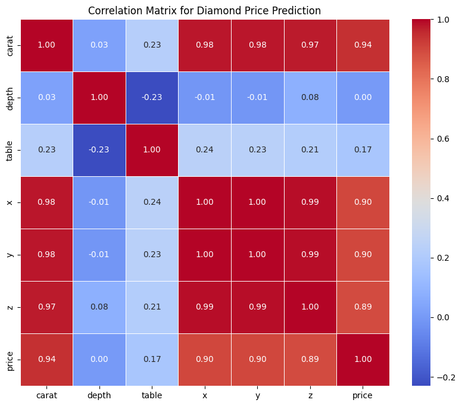
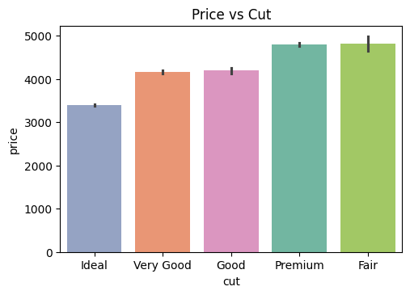
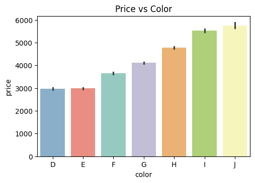
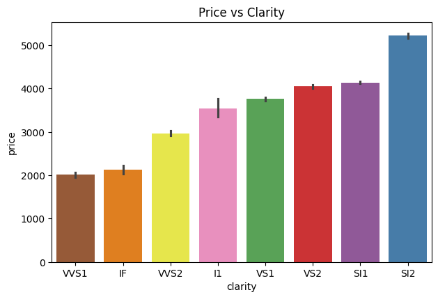
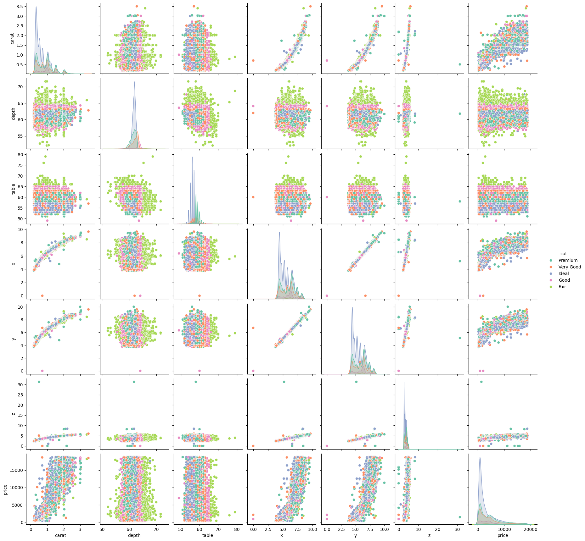
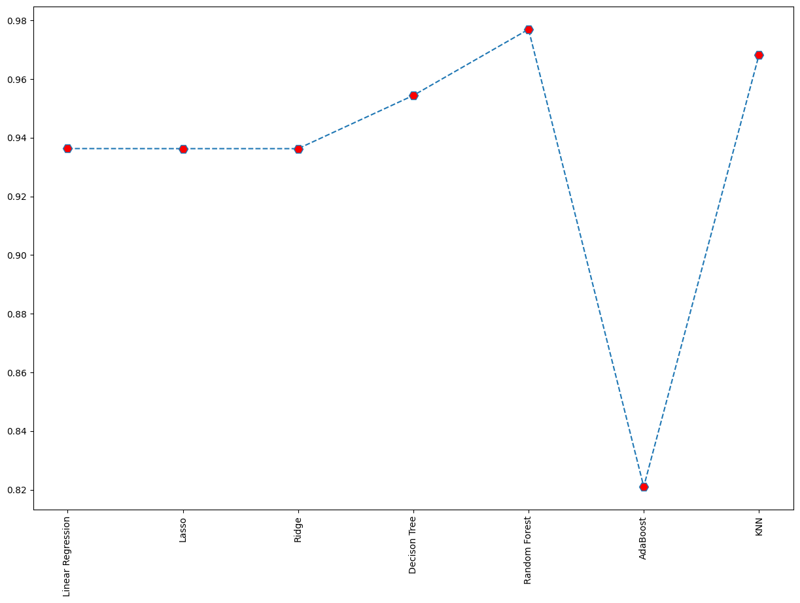

# Diamond Price Prediction

## Overview
The **Diamond Price Prediction** project aims to predict the price of diamonds based on various features such as the diamond's cut, color, clarity, carat weight, and other relevant attributes. This project uses machine learning models to analyze patterns and provide accurate price predictions for diamonds. The dataset used includes information about various diamonds and their respective prices.

## Objective
The objective of this project is to build a model that can predict the price of a diamond based on several categorical and numerical features. This project involves:
- Data preprocessing
- Feature engineering
- Model training and evaluation
- Price prediction using machine learning algorithms

## Dataset
The dataset used for this project contains information about diamonds with the following columns:
- **cut**: The quality of the cut of the diamond (e.g., Ideal, Good, Fair, etc.)
- **color**: The color grade of the diamond (e.g., D, E, F, etc.)
- **clarity**: The clarity of the diamond (e.g., IF, VVS1, VVS2, SI1, etc.)
- **carat**: The weight of the diamond.
- **depth**: The depth percentage of the diamond.
- **table**: The table percentage of the diamond.
- **price**: The price of the diamond (target variable).
- **x, y, z**: Dimensions of the diamond (length, width, and depth).


## Tools and Technologies
- **Python**: The primary programming language used for data manipulation and model building.
- **Libraries**:
  - `pandas`: For data manipulation and cleaning.
  - `numpy`: For numerical computations.
  - `matplotlib`, `seaborn`: For data visualization.
  - `scikit-learn`: For building and evaluating machine learning models.
  - `xgboost` (optional): For advanced regression models.
  
## Data Analysis

### 1. Distribution of Diamond Prices
We started the analysis by visualizing the distribution of diamond prices in the dataset.



- The distribution of diamond prices is right-skewed, which means there are a few high-priced diamonds compared to the majority of diamonds with lower prices. This indicates that most diamonds in the dataset are relatively affordable, while some rare diamonds are priced much higher.

### 2. Correlation Between Features
Next, we explored the correlation between numerical features such as `carat`, `depth`, `table`, and `price`.



- **Carat** shows a strong positive correlation with **price**, indicating that larger diamonds tend to be more expensive.
- **Depth** and **Table** do not show strong correlations with **price**, which suggests that other features like **cut**, **color**, and **clarity** might play a more significant role in price prediction.

### 3. Relationship Between Categorical Features and Price

We then visualized the relationship between categorical features (`cut`, `color`, and `clarity`) and diamond prices.

#### Cut vs Price



- Diamonds with an "Ideal" cut tend to be priced higher than diamonds with "Fair" or "Good" cuts. This suggests that the quality of the cut has a significant impact on the diamond's price.

#### Color vs Price



- As expected, diamonds with better color grades (closer to "D") are generally priced higher than diamonds with lower color grades (e.g., "J").

#### Clarity vs Price



- Diamonds with higher clarity (e.g., "IF" or "VVS1") are priced higher than diamonds with lower clarity, such as "I1" or "SI1". The clarity of the diamond is an important factor influencing its price.

### 4. Multicollinearity Check
We checked for multicollinearity between features like `x`, `y`, and `z` using the correlation matrix.


- The correlation matrix shows that the dimensions `x`, `y`, and `z` are highly correlated with each other, which could lead to multicollinearity issues when building predictive models. This will need to be addressed, either by removing one of the dimensions or combining them into a new feature (e.g., volume).

- Pairplot for multicollinearity




## Steps Involved

### 1. Data Preprocessing
- **Data Cleaning**: Handle missing values, outliers, and irrelevant columns.
- **Encoding Categorical Features**: Convert categorical variables (cut, color, clarity) into numerical format using techniques like label encoding or one-hot encoding.
- **Scaling**: Standardize or normalize numerical features such as carat, depth, and table.

### 2. Feature Engineering
- **Interaction Features**: Create new features by combining existing ones to improve model performance (e.g., combining carat and cut to create a new feature).
- **Dimensionality Reduction**: If necessary, reduce the number of features using techniques like PCA (Principal Component Analysis) to handle multicollinearity.

### 3. Model Building
- **Train-Test Split**: Split the data into training and testing datasets.
- **Model Selection**:
  - Linear Regression
  - Decision Trees
  - Random Forest
  - Gradient Boosting (e.g., XGBoost)
- **Hyperparameter Tuning**: Tune the models using techniques like grid search or random search for better accuracy.

### 4. Model Evaluation
- **Metrics**: Evaluate the models using metrics such as RMSE (Root Mean Squared Error), MAE (Mean Absolute Error), R² (Coefficient of Determination).
- **Cross-validation**: Use cross-validation to ensure the model generalizes well to unseen data.

## 5. Model R² Score Comparison

The table below shows the R² scores (accuracy) of different models used for predicting diamond prices:

| Model             | R² Score  |
|-------------------|-----------|
| Linear Regression | 0.936291  |
| Lasso             | 0.936267  |
| Ridge             | 0.936267  |
| Decision Tree     | 0.954402  |
| Random Forest     | 0.976938  |
| AdaBoost          | 0.821043  |
| KNN               | 0.968191  |


### Explanation:
- This table summarizes the **R² score** for each model, where a higher R² score indicates a better fit of the model to the data.
- The **Random Forest** model has the highest R² score, indicating the best predictive accuracy, while **AdaBoost** has the lowest.




### 6. Prediction
- Once the model is trained and tuned, it can be used to predict diamond prices based on new input data.

## Installation

### Requirements
- Python 3.8+

- Required Python libraries:
  ```bash
  pip install pandas numpy scikit-learn xgboost matplotlib seaborn flask 


Visit the web app. :- http://127.0.0.1:5000/
Enter the attributes of the diamond in the input form.
Click the "Predict" button.
Receive the predicted price of the diamond.
